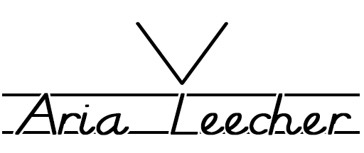



##Aria Leecher

Download your links to your server for local use!

##requirements

    PHP >= 5.4
    Python >= 3
    Aria2c >= 1.18

###License

The Laravel framework is open-sourced software licensed under the [MIT license](http://opensource.org/licenses/MIT)
